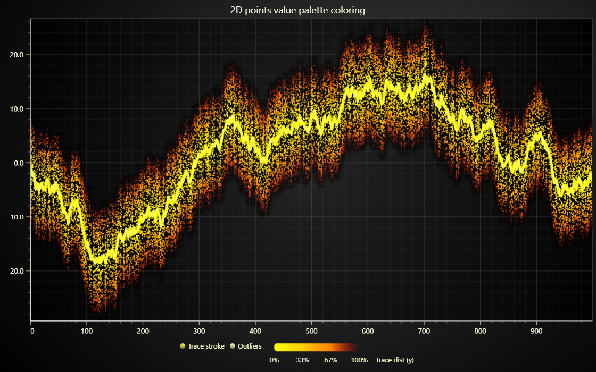

# JavaScript 2D Points Value Palette Coloring

This demo application belongs to the set of examples for LightningChart JS, data visualization library for JavaScript.

LightningChart JS is entirely GPU accelerated and performance optimized charting library for presenting massive amounts of data. It offers an easy way of creating sophisticated and interactive charts and adding them to your website or web application.

The demo can be used as an example or a seed project. Local execution requires the following steps:

-   Make sure that relevant version of [Node.js](https://nodejs.org/en/download/) is installed
-   Open the project folder in a terminal:

          npm install              # fetches dependencies
          npm start                # builds an application and starts the development server

-   The application is available at _http://localhost:8080_ in your browser, webpack-dev-server provides hot reload functionality.

## Description

_2D points dynamic coloring by value palette_

This example showcases a new feature in LCJS v3.0.1 release - dynamic coloring of 2D points using a value palette.

Value palette coloring is a really powerful feature, which allows dynamic coloring based on any kind data set.

In this example it is used to color a data set based on Y distance from another data set.

In practice, this is done by calculating the Y difference and assigning a `value` property to each data point - naturally, there are endless different ways this can be used.

In addition to this, dynamic coloring by `x` or `y` coordinate is also supported. This is activated simply by setting the `PalettedFill.lookUpProperty` to either `'x'` or `'y'`.

## API Links

* [XY cartesian chart]
* [Solid line style]
* [Point shape options]
* [Paletted fill style]
* [Color lookup table]
* [Color factory RGBA]

## Support

If you notice an error in the example code, please open an issue on [GitHub][0] repository of the entire example.

Official [API documentation][1] can be found on [LightningChart][2] website.

If the docs and other materials do not solve your problem as well as implementation help is needed, ask on [StackOverflow][3] (tagged lightningchart).

If you think you found a bug in the LightningChart JavaScript library, please contact sales@lightningchart.com.

Direct developer email support can be purchased through a [Support Plan][4] or by contacting sales@lightningchart.com.

[0]: https://github.com/Arction/
[1]: https://lightningchart.com/lightningchart-js-api-documentation/
[2]: https://lightningchart.com
[3]: https://stackoverflow.com/questions/tagged/lightningchart
[4]: https://lightningchart.com/support-services/

© LightningChart Ltd 2009-2022. All rights reserved.

[XY cartesian chart]: https://lightningchart.com/js-charts/api-documentation/v5.2.0/classes/ChartXY.html
[Solid line style]: https://lightningchart.com/js-charts/api-documentation/v5.2.0/classes/SolidLine.html
[Point shape options]: https://lightningchart.com/js-charts/api-documentation/v5.2.0/enums/PointShape.html
[Paletted fill style]: https://lightningchart.com/js-charts/api-documentation/v5.2.0/classes/PalettedFill.html
[Color lookup table]: https://lightningchart.com/js-charts/api-documentation/v5.2.0/classes/LUT.html
[Color factory RGBA]: https://lightningchart.com/js-charts/api-documentation/v5.2.0/functions/ColorRGBA.html

